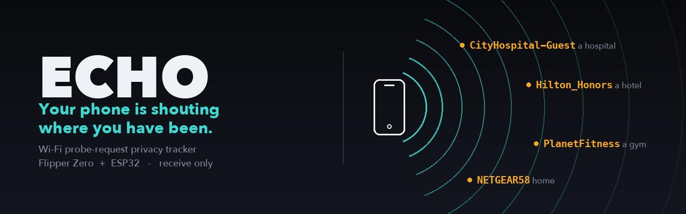
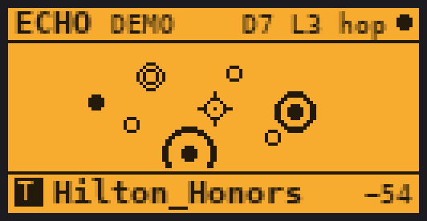
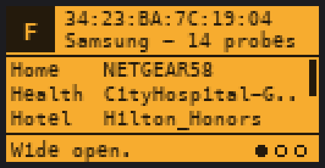
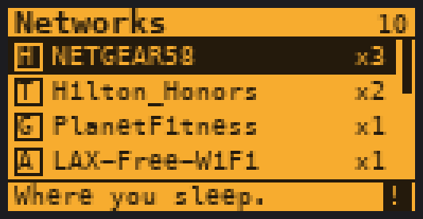
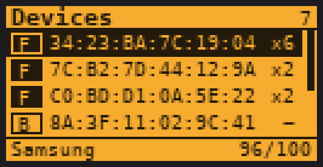
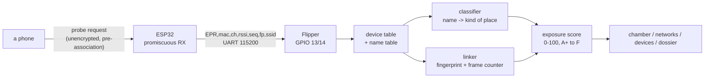
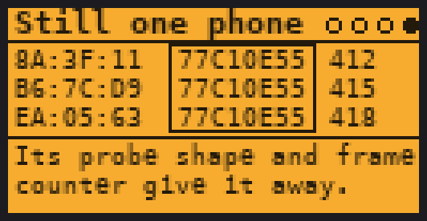
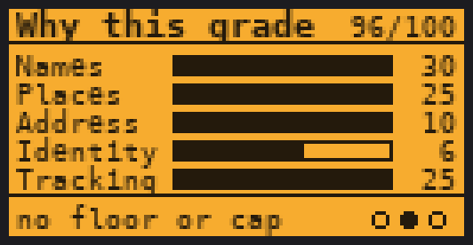

<p align="center">
  
</p>

<p align="center">
  
  
  
  
  
  <a href="https://github.com/at0m-b0mb/Echo-FlipperZero/actions/workflows/build.yml"></a>
</p>

---

Your phone remembers every Wi-Fi network you have ever joined. To find them again, many
phones read that list out loud — by name, over the air, to anybody within range, before
any password is exchanged and without joining anything.

**Echo listens.** It draws the room as a chamber of ripples, one for each device calling
out, and prints what they said: a hotel, a gym, a clinic, the router in your kitchen.
Then it grades each device on how much of itself it gave away.

It is equally careful about the other half of the story. A current phone with private
Wi-Fi addresses switched on and no stale saved networks leaks **nothing** here — and Echo
says so, in as many words, on its own screen.

<p align="center">
  
  
</p>
<p align="center">
  
  
</p>

---

## What it actually does

| | |
|---|---|
| **Listens** | ESP32 in promiscuous mode, filtered down to 802.11 probe requests. Channel hop 1–13, or camp on one. |
| **Reads the room** | The chamber screen: you in the middle, every device around you, a ripple for every probe. `OK` flips to the raw feed. |
| **Names the places** | 250-odd rules turn `Hilton_Honors` into *Hotel — a night away from home* and `CityHospital-Guest` into *Health*. Sixteen categories. |
| **Flags the pinnable ones** | `NETGEAR` is on a million routers; `NETGEAR58` is one house. Echo marks the names distinctive enough to resolve to one street address. |
| **Defeats randomization** | Same probe fingerprint on three MACs, with the frame counter carrying straight on through the change? That is one radio wearing three names, and Echo can prove it. |
| **Grades the device** | A+ to F out of 100, across five columns you can read on screen. |
| **Saves a report** | Redacted: MACs cut to the vendor prefix, names to three characters. |
| **Demo mode** | No board? A scripted room of five phones, so the app is never a menu and an empty screen. |

## What it cannot do

This matters more than the feature list, because every one of these is something a
tool like this could be mistaken for doing.

- **It cannot tell you whose phone it is.** It sees a radio, not a person.
- **It cannot geolocate a network.** It says what *kind* of place a name sounds like.
  Turning `Hilton_Honors` into a street address needs a wardriving database Echo does
  not carry and never queries.
- **It cannot tell two identical phone models apart by fingerprint alone.** That is
  exactly why a bare fingerprint match reads `Likely` and only a continuing frame
  counter earns `Confirmed`.
- **It cannot see a phone that stays quiet.** A device that only sends broadcast probes
  from a randomized address is invisible to this, correctly, and scores A+.
- **It never transmits.** No deauth, no evil twin, no association. The ESP32 comes up in
  `WIFI_MODE_NULL`, which cannot join or announce anything even by accident.

---

## How it works



### 1. The probe request

A phone looking for a saved network can wait for a beacon, or it can ask. Asking is
faster, so phones ask — and a *directed* probe request contains the SSID it is asking
for, in the clear, addressed to the broadcast address. Anything with a radio in range
hears it.

Modern iOS and Android mostly send *broadcast* probes with no name in them, which is why
this is a demo about privacy done right as much as privacy done wrong. Devices still
leak when they have hidden networks saved, when the OS is old, and on a great deal of
non-phone hardware.

### 2. The name is the place

A saved-network list is a travel diary written by accident. Echo classifies each name
into one of sixteen kinds of place, and weights them by what they give away — a home
router and a hospital sit at the top of the scale, a coffee chain at the bottom.

The tricky part is that most names are mass-produced. `Hilton_Honors` is the same string
in nine hundred buildings; `Sharma_Home_5G` is one front door. Echo splits a name into
words and checks them against a vocabulary of the ones every router on the street
shares. If a single word is unfamiliar, the name points somewhere — and gets the `!`
marker on the networks screen.

### 3. A new address is not a new phone

MAC randomization is the right answer to all of the above, and Echo shows where it
falls short:

- Phones differ in which information elements they put in a probe, in what order, and in
  the exact contents of the rate and capability fields. Hash that (excluding the SSID,
  which varies) and you get a **fingerprint** that survives a change of address.
- The 802.11 **sequence counter** is 12 bits and increments per frame. Several
  randomization implementations forget to reset it when they change MAC. A new address
  whose counter carries on from an old one is the same radio — counters do not continue
  by coincidence.

Fingerprint alone → `Likely`. Fingerprint **and** a continuing counter → `Confirmed`.

<p align="center">
  
  
</p>

---

## The exposure score

Every device gets a number out of 100 and a letter. The five columns are printed on
screen, so the grade can be read rather than trusted.

| Column | Max | What earns it |
|---|---:|---|
| **Names** | 30 | Distinct named networks. The first costs 12, each after that 7. |
| **Places** | 25 | The most telling category it revealed, times five. |
| **Address** | 10 | At least one name distinctive enough to pin one address. |
| **Identity** | 10 | A person's name in an SSID (10), or a real MAC with a known vendor (6). |
| **Tracking** | 25 | Real MAC (25), randomization defeated (14), fingerprint match (7), clean (0). |

| Score | Grade | Verdict |
|---:|:---:|---|
| 0 | **A+** | Silent. Nothing learned. |
| 1–9 | **A** | Almost nothing given up. |
| 10–24 | **B** | A small leak. |
| 25–44 | **C** | Followable. |
| 45–64 | **D** | Places you have been. |
| 65–100 | **F** | Wide open. |

Two rules bend the arithmetic on purpose, and both are printed on the device when they
fire:

- **Floor** — a device that leaked even one network name cannot score better than **B**,
  however clean the rest of it is. One name is one place you have been.
- **Cap** — a home or health network named from a permanent MAC cannot score better than
  **D**. That pair is an address attached to a person.

### Category tags

The letter in each list row; the full sentence appears in the strip underneath.

| | | | | | | | |
|:-:|---|:-:|---|:-:|---|:-:|---|
| `H` | Home | `T` | Hotel | `A` | Airport | `F` | In-flight |
| `W` | Work | `M` | Health | `G` | Gym | `E` | Study |
| `C` | Cafe | `S` | Shop | `R` | Transit | `V` | Vehicle |
| `P` | Hotspot | `D` | Device | `X` | Carrier | `?` | Unknown |

---

## Hardware

Any ESP32 dev board, or the Flipper Zero Wi-Fi devboard (which is already bridged — just
plug it in).

| ESP32 | Flipper Zero |
|---|---|
| `TX` (UART0) | pin **13** (`RX`) |
| `RX` (UART0) | pin **14** (`TX`) |
| `GND` | `GND` (pin 8, 11 or 18) |
| `5V`/`3V3` | `5V` (pin 1) or `3V3` (pin 9) |

115200 8N1. Echo takes the USART away from the expansion service while it is listening
and hands it straight back when you return to the menu.

## Install

**The app.** Grab `echo.fap` from
[Releases](https://github.com/at0m-b0mb/Echo-FlipperZero/releases) and drop it in
`SD/apps/GPIO/`. Or build it:

```bash
git clone https://github.com/at0m-b0mb/Echo-FlipperZero.git && cd Echo-FlipperZero && ufbt
```

**The sniffer.** Open `esp32/echo_esp32/echo_esp32.ino` in the Arduino IDE with ESP32
board support installed, pick your board, and flash. No libraries required — it talks to
`esp_wifi` directly.

Then: **Apps → GPIO → Echo → Listen**. No board to hand? **Settings → Demo mode → ON**.

## Using it

```
Echo
├── Listen          the chamber; OK toggles the raw feed
├── Networks        every name heard, most telling first
├── Devices         every radio, most exposed first; OK opens its dossier
├── How it works    four animated pages
├── Save report     redacted, to apps_data/echo/
├── Settings        channel · alerts · demo · sound · vibro · LED · forget everything
└── About           including what Echo cannot do
```

| Screen | Controls |
|---|---|
| Chamber | `OK` chamber ↔ feed, `Back` menu |
| Lists | `Up`/`Down` scroll, `OK` open (devices), `Back` menu |
| Dossier | `Left`/`Right` pages, `Up`/`Down` scroll names |
| How it works | `Left`/`Right` pages |

Alerts default to **Places** — a buzz only when a home, workplace or clinic is named for
the first time. **Any name** is for a quiet room; **Off** is for a busy one.

---

## Wire protocol

Newline-terminated ASCII, 115200 8N1. The SSID is deliberately the last field, so a
network name containing a comma survives the trip whole.

**ESP32 → Flipper**

| Line | Meaning |
|---|---|
| `EHELLO,<version>` | on boot and in reply to `PING` |
| `EPR,<mac12hex>,<ch>,<rssi>,<seq>,<fp8hex>,<ssid>` | one probe request; empty SSID = broadcast probe |
| `ESTAT,<heard>,<ch>` | heartbeat, ~1 Hz |

**Flipper → ESP32**

`START` · `STOP` · `CHAN:<0-13>` (0 = hop) · `PING`

---

## Build and test

```bash
make -C test        # 44,000+ checks over the classifier and the scorer
ufbt               # the FAP
```

The classifier and the exposure engine carry no Flipper headers, so they compile and run
on a laptop under the same `-Werror` settings the firmware uses. The suite covers the
classification table, token boundaries (`LAX-Free-WiFi` is an airport, `Relaxing Room` is
not), sequence-counter wraparound, and a sweep of the whole scorer input space asserting
the properties the screens depend on — bounded score, grade that matches score, and
monotonicity in every direction where leaking more must never look better.

It also enforces a width budget on every user-facing string, so a nicer turn of phrase
cannot quietly run off the right-hand edge of a 128-pixel screen.

The README screenshots are generated by `tools_gen_mockups.py`, which ports the draw code
from the views and takes every number from `test/host_echo_test --dump` — the shipped
engine scoring the demo personas. Nothing on them was typed in by hand.

```
echo.c / echo_i.h        app lifecycle, alerts, the one path a probe takes
helpers/probe_intel.*    names -> places, MACs -> vendors, fingerprints   (host-testable)
helpers/exposure.*       the score, the grade, the floor and the cap      (host-testable)
helpers/echo_db.*        device and name tables, MAC linking
helpers/uart_link.*      USART worker and line protocol
helpers/demo_feed.*      the scripted room
helpers/echo_report.*    redacted SD report
views/                   chamber, networks, devices, dossier, primer
scenes/                  scene manager wiring
esp32/echo_esp32/        the sniffer firmware
test/                    host tests + the mockup data source
```

---

## Legality and manners

Probe requests are broadcast in the clear and Echo only receives — but "it was in the
air" is not a legal argument everywhere. Recording device identifiers can engage privacy
and interception law depending on where you are, and a MAC address is personal data under
several of them.

Use it on your own phones, in a talk where the room knows what you are doing, and on
people who asked you to. Do not run it as a passive logger in a public place. The saved
report is redacted for exactly this reason.

## Credits

Named for the nymph who could only repeat what she had already heard.

Built by [at0m-b0mb](https://github.com/at0m-b0mb) · MIT licensed · pairs with
[Argus](https://github.com/at0m-b0mb/Argus-FlipperZero) (deauth and evil-twin detection),
[Skimscan](https://github.com/at0m-b0mb/Skimscan-FlipperZero) and
[GhostTag](https://github.com/at0m-b0mb/GhostTag-FlipperZero).
